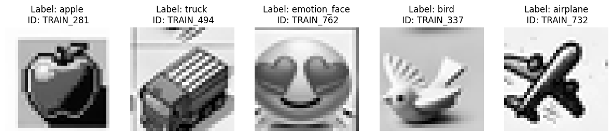
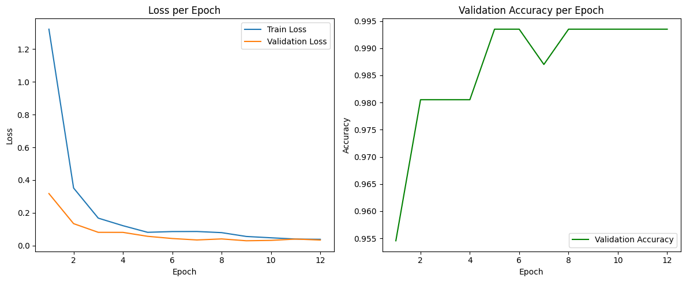
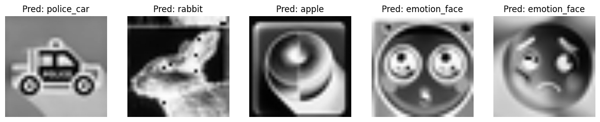

# Import


```python
import pandas as pd
import json
import numpy as np
import matplotlib.pyplot as plt

import torch
from torchvision.transforms import Compose, ToPILImage, Resize, ToTensor, Normalize, transforms
from torch.utils.data import Dataset, DataLoader
import torch.nn as nn
import torch.optim as optim

from sklearn.model_selection import train_test_split, StratifiedKFold
from sklearn.preprocessing import LabelEncoder

import timm

from IPython.display import display
from tqdm import tqdm
import random
from glob import glob

# gpu 사용 가능 여부
device = torch.device("cuda:0" if torch.cuda.is_available() else "cpu")
print(device)
```

    cuda:0


# Data load


```python
train = pd.read_csv('./data/train.csv')
test = pd.read_csv('./data/test.csv')
display(train.head())
display(test.head())
```


<div>
<style scoped>
    .dataframe tbody tr th:only-of-type {
        vertical-align: middle;
    }

    .dataframe tbody tr th {
        vertical-align: top;
    }

    .dataframe thead th {
        text-align: right;
    }
</style>
<table border="1" class="dataframe">
  <thead>
    <tr style="text-align: right;">
      <th></th>
      <th>ID</th>
      <th>label</th>
      <th>0</th>
      <th>1</th>
      <th>2</th>
      <th>3</th>
      <th>4</th>
      <th>5</th>
      <th>6</th>
      <th>7</th>
      <th>...</th>
      <th>1014</th>
      <th>1015</th>
      <th>1016</th>
      <th>1017</th>
      <th>1018</th>
      <th>1019</th>
      <th>1020</th>
      <th>1021</th>
      <th>1022</th>
      <th>1023</th>
    </tr>
  </thead>
  <tbody>
    <tr>
      <th>0</th>
      <td>TRAIN_000</td>
      <td>building</td>
      <td>251</td>
      <td>196</td>
      <td>51</td>
      <td>63</td>
      <td>68</td>
      <td>78</td>
      <td>189</td>
      <td>34</td>
      <td>...</td>
      <td>85</td>
      <td>195</td>
      <td>63</td>
      <td>30</td>
      <td>73</td>
      <td>65</td>
      <td>63</td>
      <td>201</td>
      <td>251</td>
      <td>248</td>
    </tr>
    <tr>
      <th>1</th>
      <td>TRAIN_001</td>
      <td>building</td>
      <td>247</td>
      <td>184</td>
      <td>203</td>
      <td>237</td>
      <td>255</td>
      <td>255</td>
      <td>193</td>
      <td>255</td>
      <td>...</td>
      <td>242</td>
      <td>239</td>
      <td>241</td>
      <td>242</td>
      <td>242</td>
      <td>241</td>
      <td>241</td>
      <td>241</td>
      <td>240</td>
      <td>238</td>
    </tr>
    <tr>
      <th>2</th>
      <td>TRAIN_002</td>
      <td>building</td>
      <td>217</td>
      <td>223</td>
      <td>232</td>
      <td>231</td>
      <td>239</td>
      <td>212</td>
      <td>109</td>
      <td>115</td>
      <td>...</td>
      <td>96</td>
      <td>90</td>
      <td>103</td>
      <td>166</td>
      <td>191</td>
      <td>163</td>
      <td>190</td>
      <td>190</td>
      <td>206</td>
      <td>231</td>
    </tr>
    <tr>
      <th>3</th>
      <td>TRAIN_003</td>
      <td>cat</td>
      <td>133</td>
      <td>149</td>
      <td>153</td>
      <td>138</td>
      <td>68</td>
      <td>157</td>
      <td>159</td>
      <td>166</td>
      <td>...</td>
      <td>245</td>
      <td>241</td>
      <td>247</td>
      <td>255</td>
      <td>250</td>
      <td>190</td>
      <td>186</td>
      <td>244</td>
      <td>254</td>
      <td>201</td>
    </tr>
    <tr>
      <th>4</th>
      <td>TRAIN_004</td>
      <td>building</td>
      <td>240</td>
      <td>213</td>
      <td>187</td>
      <td>159</td>
      <td>112</td>
      <td>134</td>
      <td>239</td>
      <td>233</td>
      <td>...</td>
      <td>148</td>
      <td>59</td>
      <td>163</td>
      <td>133</td>
      <td>92</td>
      <td>196</td>
      <td>221</td>
      <td>194</td>
      <td>182</td>
      <td>251</td>
    </tr>
  </tbody>
</table>
<p>5 rows × 1026 columns</p>
</div>


<div>
<style scoped>
    .dataframe tbody tr th:only-of-type {
        vertical-align: middle;
    }

    .dataframe tbody tr th {
        vertical-align: top;
    }

    .dataframe thead th {
        text-align: right;
    }
</style>
<table border="1" class="dataframe">
  <thead>
    <tr style="text-align: right;">
      <th></th>
      <th>ID</th>
      <th>0</th>
      <th>1</th>
      <th>2</th>
      <th>3</th>
      <th>4</th>
      <th>5</th>
      <th>6</th>
      <th>7</th>
      <th>8</th>
      <th>...</th>
      <th>1014</th>
      <th>1015</th>
      <th>1016</th>
      <th>1017</th>
      <th>1018</th>
      <th>1019</th>
      <th>1020</th>
      <th>1021</th>
      <th>1022</th>
      <th>1023</th>
    </tr>
  </thead>
  <tbody>
    <tr>
      <th>0</th>
      <td>TEST_000</td>
      <td>186</td>
      <td>189</td>
      <td>189</td>
      <td>190</td>
      <td>190</td>
      <td>190</td>
      <td>192</td>
      <td>191</td>
      <td>192</td>
      <td>...</td>
      <td>200</td>
      <td>200</td>
      <td>199</td>
      <td>197</td>
      <td>197</td>
      <td>194</td>
      <td>193</td>
      <td>191</td>
      <td>192</td>
      <td>193</td>
    </tr>
    <tr>
      <th>1</th>
      <td>TEST_001</td>
      <td>209</td>
      <td>219</td>
      <td>227</td>
      <td>227</td>
      <td>220</td>
      <td>218</td>
      <td>225</td>
      <td>225</td>
      <td>225</td>
      <td>...</td>
      <td>61</td>
      <td>103</td>
      <td>134</td>
      <td>143</td>
      <td>236</td>
      <td>220</td>
      <td>219</td>
      <td>219</td>
      <td>219</td>
      <td>214</td>
    </tr>
    <tr>
      <th>2</th>
      <td>TEST_002</td>
      <td>52</td>
      <td>232</td>
      <td>249</td>
      <td>209</td>
      <td>117</td>
      <td>63</td>
      <td>50</td>
      <td>70</td>
      <td>23</td>
      <td>...</td>
      <td>115</td>
      <td>112</td>
      <td>148</td>
      <td>173</td>
      <td>50</td>
      <td>20</td>
      <td>212</td>
      <td>251</td>
      <td>246</td>
      <td>249</td>
    </tr>
    <tr>
      <th>3</th>
      <td>TEST_003</td>
      <td>239</td>
      <td>230</td>
      <td>204</td>
      <td>222</td>
      <td>194</td>
      <td>198</td>
      <td>228</td>
      <td>235</td>
      <td>198</td>
      <td>...</td>
      <td>202</td>
      <td>170</td>
      <td>165</td>
      <td>178</td>
      <td>145</td>
      <td>175</td>
      <td>234</td>
      <td>197</td>
      <td>226</td>
      <td>238</td>
    </tr>
    <tr>
      <th>4</th>
      <td>TEST_004</td>
      <td>247</td>
      <td>247</td>
      <td>248</td>
      <td>247</td>
      <td>246</td>
      <td>246</td>
      <td>245</td>
      <td>246</td>
      <td>245</td>
      <td>...</td>
      <td>148</td>
      <td>133</td>
      <td>212</td>
      <td>243</td>
      <td>230</td>
      <td>232</td>
      <td>233</td>
      <td>234</td>
      <td>234</td>
      <td>234</td>
    </tr>
  </tbody>
</table>
<p>5 rows × 1025 columns</p>
</div>


# Image check


```python
# 랜덤으로 5개의 이미지 추출
random_index = np.random.choice(len(train), 5, replace=False)
print('추출된 이미지 index',random_index)
samples = train.iloc[random_index]
samples
```

    추출된 이미지 index [281 494 762 337 732]


<div>
<style scoped>
    .dataframe tbody tr th:only-of-type {
        vertical-align: middle;
    }

    .dataframe tbody tr th {
        vertical-align: top;
    }

    .dataframe thead th {
        text-align: right;
    }
</style>
<table border="1" class="dataframe">
  <thead>
    <tr style="text-align: right;">
      <th></th>
      <th>ID</th>
      <th>label</th>
      <th>0</th>
      <th>1</th>
      <th>2</th>
      <th>3</th>
      <th>4</th>
      <th>5</th>
      <th>6</th>
      <th>7</th>
      <th>...</th>
      <th>1014</th>
      <th>1015</th>
      <th>1016</th>
      <th>1017</th>
      <th>1018</th>
      <th>1019</th>
      <th>1020</th>
      <th>1021</th>
      <th>1022</th>
      <th>1023</th>
    </tr>
  </thead>
  <tbody>
    <tr>
      <th>281</th>
      <td>TRAIN_281</td>
      <td>apple</td>
      <td>250</td>
      <td>250</td>
      <td>250</td>
      <td>250</td>
      <td>250</td>
      <td>250</td>
      <td>250</td>
      <td>250</td>
      <td>...</td>
      <td>241</td>
      <td>240</td>
      <td>240</td>
      <td>240</td>
      <td>240</td>
      <td>241</td>
      <td>239</td>
      <td>237</td>
      <td>239</td>
      <td>247</td>
    </tr>
    <tr>
      <th>494</th>
      <td>TRAIN_494</td>
      <td>truck</td>
      <td>224</td>
      <td>187</td>
      <td>240</td>
      <td>232</td>
      <td>231</td>
      <td>228</td>
      <td>227</td>
      <td>222</td>
      <td>...</td>
      <td>158</td>
      <td>182</td>
      <td>228</td>
      <td>242</td>
      <td>235</td>
      <td>235</td>
      <td>236</td>
      <td>236</td>
      <td>238</td>
      <td>238</td>
    </tr>
    <tr>
      <th>762</th>
      <td>TRAIN_762</td>
      <td>emotion_face</td>
      <td>161</td>
      <td>161</td>
      <td>161</td>
      <td>162</td>
      <td>164</td>
      <td>163</td>
      <td>163</td>
      <td>162</td>
      <td>...</td>
      <td>147</td>
      <td>158</td>
      <td>225</td>
      <td>213</td>
      <td>197</td>
      <td>209</td>
      <td>201</td>
      <td>210</td>
      <td>186</td>
      <td>68</td>
    </tr>
    <tr>
      <th>337</th>
      <td>TRAIN_337</td>
      <td>bird</td>
      <td>206</td>
      <td>206</td>
      <td>207</td>
      <td>207</td>
      <td>206</td>
      <td>203</td>
      <td>198</td>
      <td>189</td>
      <td>...</td>
      <td>202</td>
      <td>204</td>
      <td>205</td>
      <td>206</td>
      <td>207</td>
      <td>207</td>
      <td>207</td>
      <td>208</td>
      <td>208</td>
      <td>208</td>
    </tr>
    <tr>
      <th>732</th>
      <td>TRAIN_732</td>
      <td>airplane</td>
      <td>241</td>
      <td>241</td>
      <td>241</td>
      <td>241</td>
      <td>241</td>
      <td>241</td>
      <td>240</td>
      <td>240</td>
      <td>...</td>
      <td>242</td>
      <td>242</td>
      <td>241</td>
      <td>240</td>
      <td>241</td>
      <td>241</td>
      <td>241</td>
      <td>241</td>
      <td>241</td>
      <td>241</td>
    </tr>
  </tbody>
</table>
<p>5 rows × 1026 columns</p>
</div>


```python
# 이미지 시각화
fig, axes = plt.subplots(1, 5, figsize=(15, 5))

for i, (idx, sample) in enumerate(samples.iterrows()):
    image_data = sample.iloc[2:].values.astype(np.uint8).reshape(32, 32)  # 32x32 변환 (=1024)
    axes[i].imshow(image_data, cmap='gray')
    axes[i].set_title(f"Label: {sample['label']}\n ID: {sample['ID']}")
    axes[i].axis("off")
```


    

    


# DataSet, DataLoader


```python
# 라벨 인코더 (라벨 -> 숫자)
label_encoder = LabelEncoder()
train['label'] = label_encoder.fit_transform(train["label"])
```


```python
# 테스트 데이터
test_data = test.iloc[:, 1:].values
test_data
```


    array([[186, 189, 189, ..., 191, 192, 193],
           [209, 219, 227, ..., 219, 219, 214],
           [ 52, 232, 249, ..., 251, 246, 249],
           ...,
           [238, 239, 244, ...,  93,  60, 120],
           [107, 116, 118, ..., 107, 106, 108],
           [168, 169, 171, ..., 164,  93, 100]], shape=(250, 1024))


```python
# 데이터프레임의 인덱스 길이와 20% 샘플링
valid_idx = np.random.choice(len(train), round(len(train) * 0.2), replace=False)
valid_idx = np.sort(valid_idx)  # 정렬

train_idx = np.setdiff1d(train.index, valid_idx)  # valid_idx를 제외한 train 인덱스 계산

print(train_idx, valid_idx)

# skf = StratifiedKFold(n_splits=5, shuffle=True, random_state=42)


# for train_idx, valid_idx in skf.split(train.iloc[:, 2:], train['label']):
#     break

# print(train_idx)
```

    [  0   3   4   7   8  10  12  13  18  20  21  22  23  24  25  27  29  30
      31  32  33  34  35  36  37  38  39  40  41  42  45  46  49  50  52  54
      55  56  57  58  59  62  63  65  66  67  68  69  70  71  72  74  75  76
      77  79  82  83  85  86  87  88  89  91  92  94  95  96  97  98  99 100
     102 104 106 107 108 109 110 111 112 113 114 115 116 117 118 119 120 122
     123 124 126 128 129 130 131 132 133 135 136 137 138 139 140 142 143 144
     145 146 147 148 149 151 153 154 155 156 157 158 159 160 161 162 163 164
     165 166 167 168 170 172 173 174 175 178 179 181 182 183 184 185 186 187
     188 191 192 194 195 196 198 199 200 203 204 205 206 208 209 210 211 213
     214 215 216 217 220 221 222 223 224 225 226 227 228 229 230 231 232 233
     234 235 236 237 238 239 240 241 242 243 244 245 246 247 248 249 250 252
     253 254 256 258 260 263 264 265 266 267 268 269 270 271 272 273 274 275
     276 277 278 279 280 281 282 283 284 287 288 289 291 292 293 294 297 300
     301 302 303 304 305 306 308 310 311 312 313 315 316 317 318 319 320 321
     322 325 327 328 329 330 331 332 333 334 335 336 337 339 340 341 342 344
     345 346 347 348 349 350 351 352 353 354 356 357 359 360 361 362 363 364
     365 366 367 368 369 370 372 373 374 376 378 379 380 381 382 385 386 387
     388 390 391 392 393 394 395 396 398 399 400 402 404 405 406 407 409 410
     411 412 413 414 415 416 417 420 421 422 423 424 425 426 427 428 430 431
     432 433 434 436 437 440 441 442 443 444 445 446 447 448 449 450 451 452
     455 456 457 458 459 460 461 462 464 465 466 469 470 472 474 476 477 479
     480 481 483 484 485 486 487 489 490 491 493 495 497 498 499 500 502 503
     504 505 506 507 508 509 510 511 512 513 515 516 518 519 522 524 526 528
     529 530 531 532 535 536 537 538 539 540 541 542 543 546 547 548 549 550
     551 552 553 554 555 556 557 558 559 560 561 562 564 565 567 568 569 570
     571 572 573 575 576 577 579 580 581 582 583 584 585 589 592 593 594 595
     596 597 600 601 602 603 604 605 606 607 608 609 610 612 613 614 616 617
     618 619 620 621 622 623 624 625 626 627 628 629 630 631 632 633 634 635
     636 637 638 639 640 641 642 643 644 645 646 647 648 649 651 652 653 654
     655 656 657 658 659 660 661 662 663 664 667 668 669 670 671 672 674 675
     677 679 680 682 684 685 686 687 688 689 690 691 693 694 695 696 697 699
     700 701 702 703 704 707 708 709 710 711 712 713 715 716 717 718 719 720
     721 722 723 724 725 726 727 729 730 731 732 734 735 736 737 738 739 741
     742 743 745 749 750 751 752 753 754 755 756 758 759 760 761 762 763 765
     766 767 768] [  1   2   5   6   9  11  14  15  16  17  19  26  28  43  44  47  48  51
      53  60  61  64  73  78  80  81  84  90  93 101 103 105 121 125 127 134
     141 150 152 169 171 176 177 180 189 190 193 197 201 202 207 212 218 219
     251 255 257 259 261 262 285 286 290 295 296 298 299 307 309 314 323 324
     326 338 343 355 358 371 375 377 383 384 389 397 401 403 408 418 419 429
     435 438 439 453 454 463 467 468 471 473 475 478 482 488 492 494 496 501
     514 517 520 521 523 525 527 533 534 544 545 563 566 574 578 586 587 588
     590 591 598 599 611 615 650 665 666 673 676 678 681 683 692 698 705 706
     714 728 733 740 744 746 747 748 757 764]
    [  0   3   4   6   7   8  12  13  14  15  18  19  20  22  23  24  25  26
      27  29  30  31  33  34  35  37  38  39  40  43  44  45  47  49  51  52
      53  54  56  57  58  59  61  62  63  64  65  66  67  68  69  70  71  72
      73  74  75  76  78  79  80  81  82  84  85  88  89  90  91  93  95  96
      97 100 101 102 104 106 107 108 109 110 111 112 114 115 116 117 119 120
     121 122 123 124 125 127 128 129 130 131 132 133 135 136 137 139 140 141
     142 144 145 146 150 151 152 153 154 156 157 158 160 162 163 164 165 166
     167 169 170 171 172 174 175 177 178 179 180 182 183 184 185 186 187 188
     189 190 191 192 193 194 195 197 198 199 201 202 203 205 206 207 209 210
     211 212 213 214 215 216 217 218 220 221 222 224 225 227 228 229 230 231
     232 233 234 235 236 237 238 239 241 242 243 244 245 246 248 252 253 254
     257 258 259 260 261 262 263 264 265 267 268 271 273 274 275 276 277 280
     281 282 283 284 285 286 287 288 290 291 292 293 294 295 296 297 298 299
     300 301 302 303 304 305 306 307 308 309 310 311 312 314 315 316 317 318
     319 321 323 324 325 326 327 328 329 331 333 334 335 336 337 339 340 341
     343 344 345 346 347 348 349 351 352 353 354 355 356 357 358 359 360 361
     362 363 364 365 366 367 369 370 371 373 374 375 376 378 379 380 381 382
     383 384 385 386 387 388 389 390 391 392 393 394 395 397 399 400 401 402
     403 404 406 407 408 409 410 412 414 416 417 418 419 420 421 422 423 424
     425 426 427 428 429 430 431 432 435 436 438 439 440 441 444 445 448 449
     450 451 452 454 455 456 458 459 460 462 463 464 466 467 468 469 470 471
     474 477 478 479 480 481 482 483 484 485 486 487 488 489 490 491 493 494
     495 499 500 502 503 505 506 507 508 509 510 511 512 513 514 515 516 517
     518 520 521 522 523 524 525 526 528 530 533 534 535 536 537 538 539 540
     541 542 543 544 546 547 548 549 550 551 552 553 554 555 556 557 558 559
     560 561 562 563 564 565 566 567 568 571 572 573 574 575 576 578 579 580
     581 583 584 585 586 587 588 589 590 591 593 594 595 596 597 599 601 602
     605 606 607 608 609 610 611 612 613 614 615 616 617 618 620 622 624 625
     626 627 628 629 630 632 634 635 636 637 638 639 640 642 643 644 645 646
     647 648 649 650 651 652 653 654 655 656 657 658 659 660 661 664 666 667
     668 669 670 673 675 676 679 680 681 682 683 687 688 689 690 692 693 694
     695 696 698 699 702 703 704 705 707 710 711 712 713 714 715 716 717 718
     720 721 724 725 726 727 728 729 730 732 733 734 735 736 737 738 740 741
     742 743 744 746 747 749 752 753 754 755 756 757 758 759 760 761 762 763
     765 766 767]


```python
class CustomDataset():
    def __init__(self,image_df = None, label_df = None, mode = "train", transform = None):
        self.image_df = image_df.reset_index(drop=True)
        # self.label_df = label_df
        self.label_df = label_df.reset_index(drop=True) if label_df is not None else None
        self.transform = transform

    
    def __getitem__(self, idx):
        # Reshape to (32, 32) from flattened data
        image = self.image_df.iloc[idx].values.astype(np.uint8).reshape(32, 32)
        image = torch.tensor(image, dtype=torch.float32).unsqueeze(0)  # shape: (1, 32, 32)

        if self.transform:
            image = self.transform(image)

        if self.label_df is not None:
            label = torch.tensor(self.label_df.iloc[idx], dtype=torch.long)
            return image, label
        else:
            return image
        
    def __len__(self):
        return len(self.image_df)
```


```python
train_transform = Compose([
    ToPILImage(),
    Resize((224, 224)),
    ToTensor(),
    Normalize(mean=[0.5], std=[0.5]),
])
```


```python
train_dataset = CustomDataset(image_df=train.iloc[train_idx, 2:], label_df=train.iloc[train_idx, 1], transform=train_transform)
valid_dataset = CustomDataset(image_df=train.iloc[valid_idx, 2:], label_df=train.iloc[valid_idx, 1], transform=train_transform)
test_dataset = CustomDataset(image_df=test.iloc[:, 1:], transform=train_transform)
```


```python
loader_params = {
    'batch_size': 5,
    'num_workers': 8,
    'pin_memory': True
}

train_loader = DataLoader(train_dataset, shuffle=True, **loader_params)
valid_loader = DataLoader(valid_dataset, shuffle=False, **loader_params)
test_loader = DataLoader(test_dataset, shuffle=False, **loader_params)
```

# EarlyStop


```python
class EarlyStopping:
    def __init__(self, patience=5, verbose=False):
        self.patience = patience
        self.verbose = verbose
        self.counter = 0
        self.best_loss = float('inf')
        self.early_stop = False
        self.best_model = None

    def __call__(self, val_loss, model):
        if val_loss < self.best_loss:
            self.best_loss = val_loss
            self.best_model = model.state_dict()  # 모델의 가중치 저장
            self.counter = 0
            if self.verbose:
                print(f"Validation loss decreased. Resetting counter.")
        else:
            self.counter += 1
            if self.verbose:
                print(f"No improvement. Counter: {self.counter}/{self.patience}")
            if self.counter >= self.patience:
                self.early_stop = True

```

# Model


```python
model_id = 'resnet18.tv_in1k'
model_name = model_id.split('.')[0]

model = timm.create_model(
        model_id, 
        pretrained=True,
        num_classes=10,
        in_chans=1
    )
model = model.to(device)
```


```python
EPOCHS = 100

criterion = nn.CrossEntropyLoss()
optimizer = optim.AdamW(model.parameters(), lr=5e-5)
scheduler = optim.lr_scheduler.CosineAnnealingLR(optimizer, T_max=EPOCHS)
```

## Training


```python
def train_one_epoch(model, loader, criterion, optimizer, device):
    model.train()
    running_loss = 0.0

    for images, labels in tqdm(loader, desc="Training", leave=False):
        images, labels = images.to(device), labels.to(device)
        optimizer.zero_grad()
        outputs = model(images)
        loss = criterion(outputs, labels)
        loss.backward()
        optimizer.step()

        running_loss += loss.item() * images.size(0)

    epoch_loss = running_loss / len(loader.dataset)
    return epoch_loss

def validate_one_epoch(model, loader, criterion, device):
    model.eval()
    running_loss = 0.0
    correct, total = 0, 0
    
    with torch.no_grad():
        for images, labels in tqdm(loader, desc="Validation", leave=False):
            images, labels = images.to(device), labels.to(device)
            outputs = model(images)
            loss = criterion(outputs, labels)
            
            running_loss += loss.item() * images.size(0)
            
            _, predicted = torch.max(outputs.data, 1)
            total += labels.size(0)
            correct += (predicted == labels).sum().item()

    epoch_loss = running_loss / len(loader.dataset)
    accuracy = correct / total
    return epoch_loss, accuracy

best_loss = float('inf')
best_model = None

# loss, acc 배열
train_losses = []
val_losses = []
val_accuracies = []

# early 정의
early_stopping = EarlyStopping(patience=3, verbose=True)

for epoch in range(EPOCHS):
    print(f"\nEpoch [{epoch+1}/{EPOCHS}]")

    # Train
    train_loss = train_one_epoch(model, train_loader, criterion, optimizer, device)

    # Validate
    val_loss, val_acc = validate_one_epoch(model, valid_loader, criterion, device)

    print(f"Train Loss: {train_loss:.4f} | Val Loss: {val_loss:.4f} | Val Accuracy: {val_acc*100:.2f}%")
    train_losses.append(train_loss)
    val_losses.append(val_loss)
    val_accuracies.append(val_acc)

    # Check for best model
    if val_loss < best_loss:
        best_loss = val_loss
        best_model = model
        
        best_acc = val_acc
        
    # Early Stopping 체크
    early_stopping(val_loss, model)
    if early_stopping.early_stop:
        print("Early stopping triggered.")
        break

    scheduler.step()
```

    
    Epoch [1/100]


                                                                

    Train Loss: 0.0508 | Val Loss: 0.0490 | Val Accuracy: 99.35%
    Validation loss decreased. Resetting counter.
    
    Epoch [2/100]


                                                                

    Train Loss: 0.0697 | Val Loss: 0.0479 | Val Accuracy: 99.35%
    Validation loss decreased. Resetting counter.
    
    Epoch [3/100]


                                                                

    Train Loss: 0.0396 | Val Loss: 0.0563 | Val Accuracy: 97.40%
    No improvement. Counter: 1/3
    
    Epoch [4/100]


                                                                

    Train Loss: 0.0479 | Val Loss: 0.0470 | Val Accuracy: 98.05%
    Validation loss decreased. Resetting counter.
    
    Epoch [5/100]


                                                                

    Train Loss: 0.0305 | Val Loss: 0.0412 | Val Accuracy: 99.35%
    Validation loss decreased. Resetting counter.
    
    Epoch [6/100]


                                                                

    Train Loss: 0.0368 | Val Loss: 0.0560 | Val Accuracy: 98.70%
    No improvement. Counter: 1/3
    
    Epoch [7/100]


                                                                

    Train Loss: 0.0305 | Val Loss: 0.0452 | Val Accuracy: 98.70%
    No improvement. Counter: 2/3
    
    Epoch [8/100]


                                                                

    Train Loss: 0.0443 | Val Loss: 0.0599 | Val Accuracy: 98.05%
    No improvement. Counter: 3/3
    Early stopping triggered.


    


```python
def evaluate_model(model, loader, criterion, device):
    model.eval()
    running_loss = 0.0
    correct = 0
    total = 0

    with torch.no_grad():
        for batch in loader:
            # 반환값 구조에 따라 수정
            if isinstance(batch, tuple) and len(batch) >= 2:
                images, labels = batch[:2]  # 첫 두 요소만 가져옴
            else:
                images = batch
                labels = None  # 레이블이 없는 경우

            images = images.to(device)
            if labels is not None:
                labels = labels.to(device)

            outputs = model(images)
            
            # 손실 계산 (레이블 없는 경우 무시)
            if labels is not None:
                loss = criterion(outputs, labels)
                running_loss += loss.item() * images.size(0)

            # 정확도 계산
            if labels is not None:
                _, predicted = torch.max(outputs, 1)
                total += labels.size(0)
                correct += (predicted == labels).sum().item()

    # 평균 손실 및 정확도 계산
    avg_loss = running_loss / len(loader.dataset) if total > 0 else None
    accuracy = correct / total if total > 0 else None
    return avg_loss, accuracy


# 기존에 모델과 비교
for model_path in glob('models/*'):
    if model_name in model_path:
        model.load_state_dict(torch.load(model_path))
        model.to(device)
        
        # 모델 평가
        val_loss, val_acc = evaluate_model(model, , criterion, device)

        # 출력값이 None일 경우 기본값 처리
        if val_loss is None or val_acc is None:
            print("Validation data is empty or labels are missing.")
        else:
            print(f"Validation Loss: {val_loss:.4f}, Validation Accuracy: {val_acc*100:.2f}%")

        

```

    Validation data is empty or labels are missing.


```python
# 모델 저장
torch.save(best_model.state_dict(), f'models/{model_name}_best_model.pth')
print(f'Model Save to models/{model_name}_best_model.pth')
```

# acc, loss graph


```python
epochs = range(1, len(train_losses)+1)

plt.figure(figsize=(12, 5))

# Loss 그래프
plt.subplot(1, 2, 1)
plt.plot(epochs, train_losses, label='Train Loss')
plt.plot(epochs, val_losses, label='Validation Loss')
plt.xlabel("Epoch")
plt.ylabel("Loss")
plt.title("Loss per Epoch")
plt.legend()

# Accuracy 그래프
plt.subplot(1, 2, 2)
plt.plot(epochs, val_accuracies, label='Validation Accuracy', color='green')
plt.xlabel("Epoch")
plt.ylabel("Accuracy")
plt.title("Validation Accuracy per Epoch")
plt.legend()

plt.tight_layout()
plt.show()

```


    

    


# eval

## Print Image


```python
# 테스트 로더에서 랜덤으로 5개 샘플 추출
random_samples = random.sample(range(len(test_loader.dataset)), 5)

# 랜덤으로 추출한 인덱스와 해당 이미지를 추론 및 출력
with torch.no_grad():
    fig, axes = plt.subplots(1, 5, figsize=(15, 5))
    for idx, sample_idx in enumerate(random_samples):
        # 데이터셋에서 샘플 추출
        sample = test_loader.dataset[sample_idx]  # 단일 샘플 가져오기
        
        # 샘플 형태 확인 및 처리
        if isinstance(sample, tuple) and len(sample) == 2:  # (image, label)
            image, label = sample
        else:  # 레이블 없는 데이터셋일 경우
            image = sample
            label = None
        
        image = image.unsqueeze(0).to(device)  # 배치 차원 추가 및 GPU로 이동
        
        # 모델 추론
        output = best_model(image)
        _, predicted = torch.max(output.data, 1)
        
        # 레이블 디코딩
        pred_label_decoded = label_encoder.inverse_transform([predicted.item()])[0]
        true_label_decoded = label_encoder.inverse_transform([label])[0] if label is not None else None
        
        # 이미지 출력 준비
        image = image.cpu().squeeze()  # GPU → CPU 이동 및 채널 축소
        pred_label = predicted.item()  # 예측된 레이블
        
        # 이미지 시각화
        axes[idx].imshow(image.numpy(), cmap='gray')
        if label is not None:
            axes[idx].set_title(f"True: {true_label_decoded}, Pred: {pred_label_decoded}")
        else:
            axes[idx].set_title(f"Pred: {pred_label_decoded}")
        axes[idx].axis("off")
    
    plt.show()
```


    

    


## Inference & Submission


```python
best_model.eval()
preds = []

with torch.no_grad():
    for images in tqdm(test_loader, desc="Inference", leave=False):
        images = images.to(device)
        outputs = best_model(images)
        _, predicted = torch.max(outputs.data, 1)
        preds.extend(predicted.cpu().numpy())

# Decode predictions
pred_labels = label_encoder.inverse_transform(preds)

submission = pd.read_csv('./data/sample_submission.csv')
submission['label'] = pred_labels
submission.to_csv('baseline_submission.csv', index=False)
```
